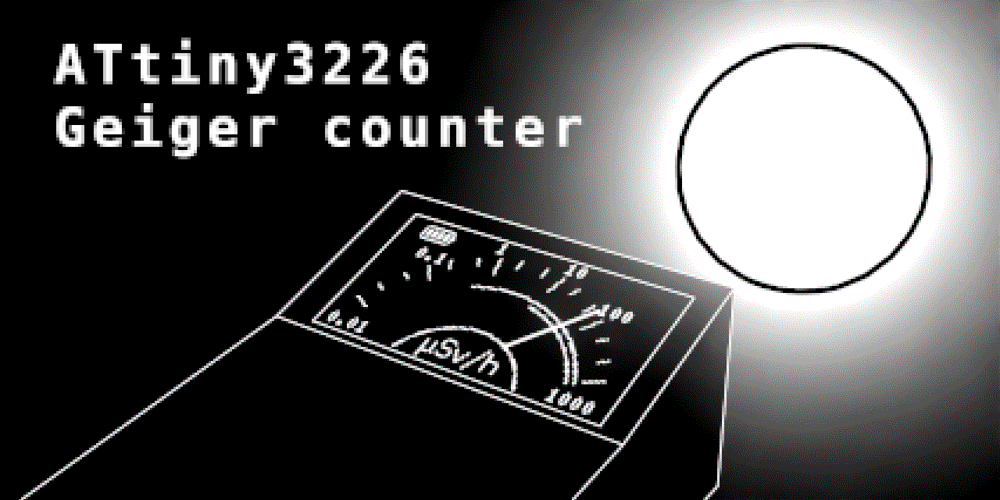
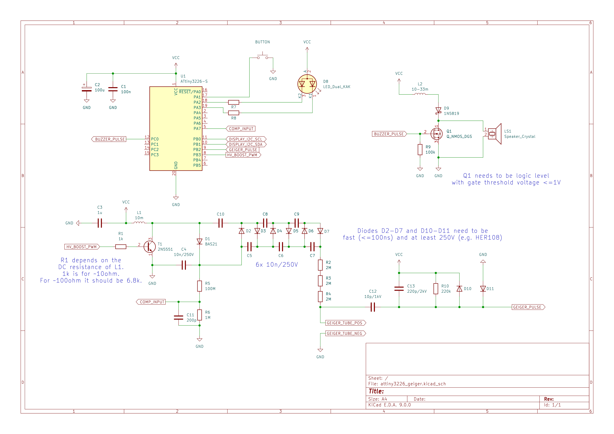
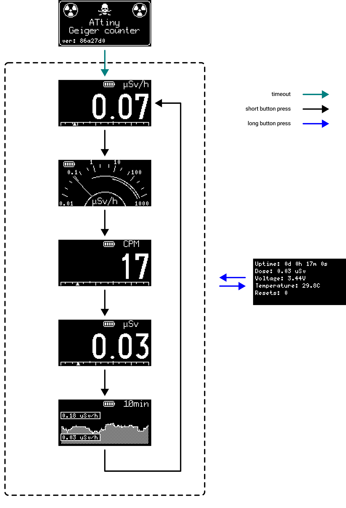

[](https://github.com/mryndzionek/attiny3226_geiger/actions/workflows/build.yml)



The goal of this project is to design a Geiger counter and
continuous radiation monitor in one device. This means two things:
 - low energy consumption, so batteries last for months of continuous monitoring
 - a display capable of displaying exact instantaneous radiation levels

Nice to have things:
 - measurement history (at least 10 minutes)
 - cumulative dose

## Schematic




## Building

At least 14.1.0 `avr-gcc` is required. Steps needed to build from source can be found in
[build.yml](.github/workflows/build.yml). [u8g2](https://github.com/olikraus/u8g2) needs to be
cloned into `external` subdirectory. Then the usual `CMake` routine can commence:


```sh
mkdir build
cd build
cmake -DCMAKE_BUILD_TYPE=Release -DAVR_MCU=attiny3226 \
      -DAVR_PROGRAMMER=serialupdi -DAVR_PROGRAMMER_PORT=/dev/ttyUSB0 \
      -DMCU_FREQ=10000000 -DCMAKE_TOOLCHAIN_FILE=../toolchain-avr-gcc.make ..
make -j
```

Fairly recent [AVRDUDE](https://github.com/avrdudes/avrdude) is also needed in order to use
UPDI flashing via a USB-to-serial converter.

## Menu structure



## More info

The average current consumption with display turned off is ~200uA.
A set of 3 AAA batteries should last more than a year.

